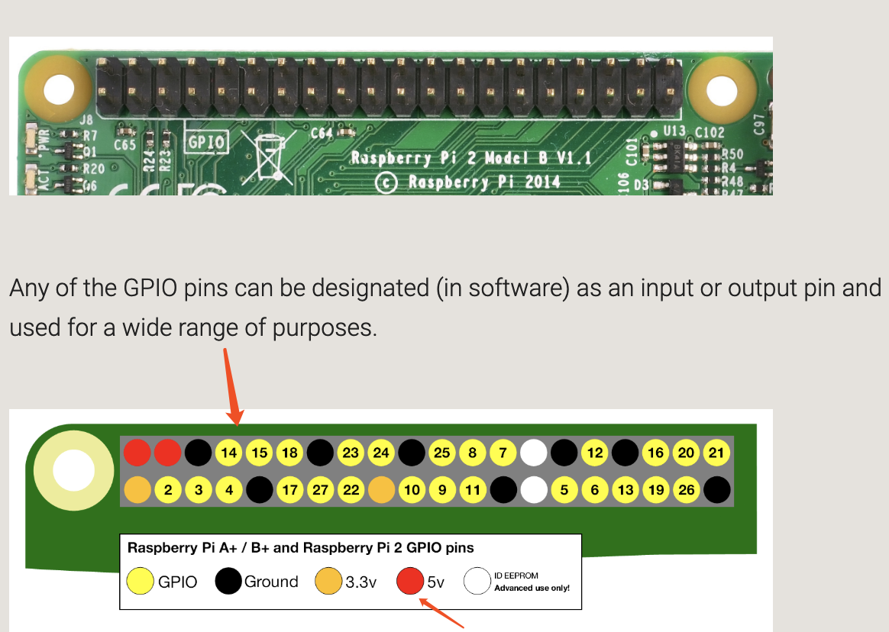
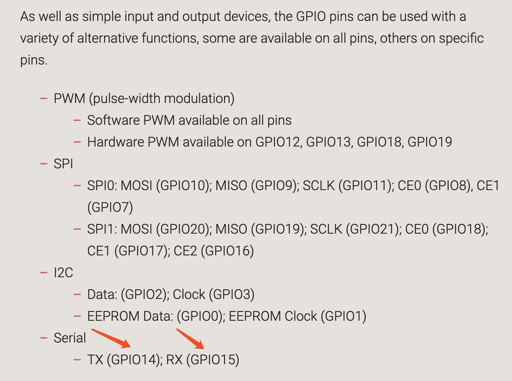
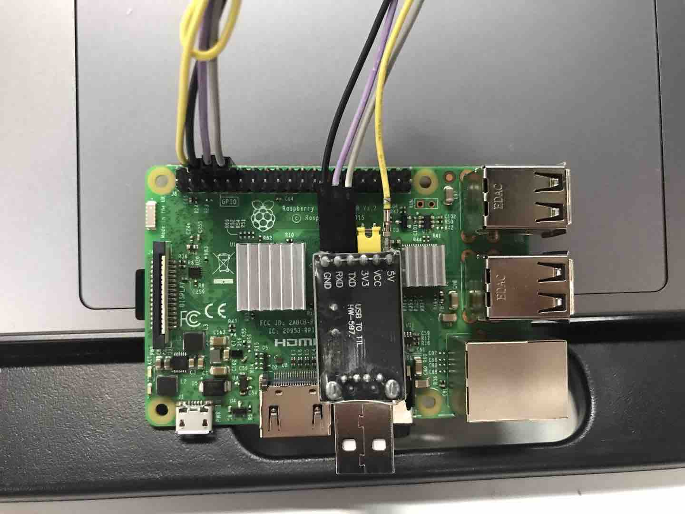

# OS-tutorials

📚 使用 Rust 和树莓派 3 进行裸机与操作系统开发教程。本仓库基于[rust-raspi3-OS-tutorials](https://github.com/rust-embedded/rust-raspi3-OS-tutorials)。

>本教程是 [斯坦福操作系统教程公开课](https://web.stanford.edu/class/cs140e/) 的一个示例，本仓库记录📝尽量做到每章节都图文并茂。

## 准备与开发环境

因为是在裸机上直接跑系统，会涉及到硬件，所以还需要读者对硬件有一点了解。

### 树莓派

首先心仪 💓的树莓派到手了，你需要熟悉一下它，最简单的办法就是安装树莓派官方的系统。为此，你需要：

1. 一个 8G 以上的 micro SD 卡
2. 此外，你需要一个读卡器

这些在大天朝某宝上都能买到，实用兼实惠。

网上有很多相关的安装教程，此处不赘述，[官方教程可以看这里](https://www.raspberrypi.org/documentation/installation/installing-images/)

### Rust

首先你需要一个合适的 rust 工具链，你需要安装 nightly 版本的 rust 以及 llvm 等等：

```bash
$ curl https://sh.rustup.rs -sSf | sh -s -- --default-toolchain nightly
$ rustup component add rust-src llvm-tools-preview
$ cargo install cargo-xbuild cargo-binutils
$ rustup component add clippy-preview --toolchain=nightly
```

⚠️⚠️⚠️ 读者需确保自己的编译环境搭建好 ⚠️⚠️⚠️

### Micro SD卡相关

当你安装了树莓派的提供的系统并且让它很好的运行起来后，你的 micro SD 卡已经是 FAT 文件系统，并且已经建好了 MSR 分区。

当你使用读卡器读取 micro SD 卡的内容时，你会发现里面的内容与树莓派官方提供的 [固件文件](https://github.com/raspberrypi/firmware/tree/master/boot) 是一致的。当你需要更新系统时，可以直接更换树莓派官方提供的 [固件文件](https://github.com/raspberrypi/firmware/tree/master/boot) 。

当我们进行实验的时候，我们需要将原来的 `kernel`,`.img` 镜像文件删除，并换成我们自己编译出来文件。

>为什么要这么做，以后尽量补上。

### Usb 转 ttl 串口线

英文翻译过来是 USB 串行调试线，不知道买什么样的同学可以直接某宝搜索“树莓派USB串口线”。

#### 连接方式

电源线 🔌与 5v 连接，GND 互相连接，TX (GPIO14)、RX (GPIO15)交错连接。有关树莓派的 GPIO 更多信息，请看[官方描述](https://www.raspberrypi.org/documentation/usage/gpio/).





>题外话，可能过程中会遇到一些问题，读者需细心检查。我在连接的时候自己坑了自己一把，就是杜邦线有松动导致电源不稳定，常常弄着弄着就断电了。

连接参考：


连接上你的电脑后（*nix系统，window的童鞋可以使用串口连接工具）,执行：

```bash
sudo screen /dev/ttyUSB0 115200
```

这样你就可以用过串口线与 pi 通信了，如需退出，可以按 `ctrl-a`, `ctrl-d`。